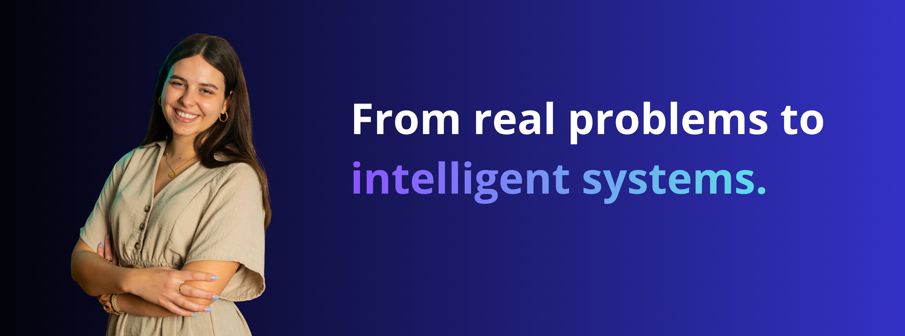

  

 

# Hi, I'm Nuria Díaz Rey 👋

### AI Engineer | Building Agentic AI & LLM-powered Systems

Robotics Engineer focused on building production-oriented AI systems, combining **LLMs, agentic workflows, RAG, APIs and automation** to solve real-world problems.

[LinkedIn](TU_LINKEDIN) · [Email](mailto:TU_EMAIL)

---

> *"Engineering starts with understanding the problem, not choosing the technology."*

---

## 👩‍💻 About Me

- 🤖 **AI Engineer:** Building AI-powered solutions that combine LLMs, APIs, business systems and automation.

- 🧠 **Agentic AI:** Currently deepening my expertise in AI agents, tool calling, RAG and production-oriented LLM applications.

- ⚙️ **Applied AI:** Experience developing AI solutions for real business processes, including conversational assistants, voice agents and intelligent automation.

- 🧪 **AI Evaluation:** Previous experience evaluating AI models using Python, performance metrics and structured testing methodologies.

- 🎓 **Background:** Robotics Engineering, combining software, AI and engineering fundamentals.

---

## 🛠️ Technologies & Tools

### 🧠 AI & Data

  
  
  
  

**AI concepts:** `LLMs` · `RAG` · `AI Agents` · `Tool Calling` · `Model Evaluation`

### 🤖 Agentic AI & Vector Search

  
  

### ⚙️ Backend & Databases

  
  
  

### 🔄 Automation & AI Platforms

  
  

### 🛠️ Engineering

  
  
  

---
---

### Contact

[LinkedIn](https://www.linkedin.com/in/nuria-diaz-rey/) · [Email](nuriadiazrey@gmail.com)
